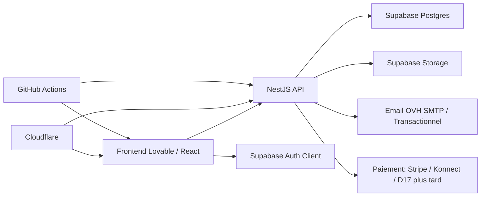
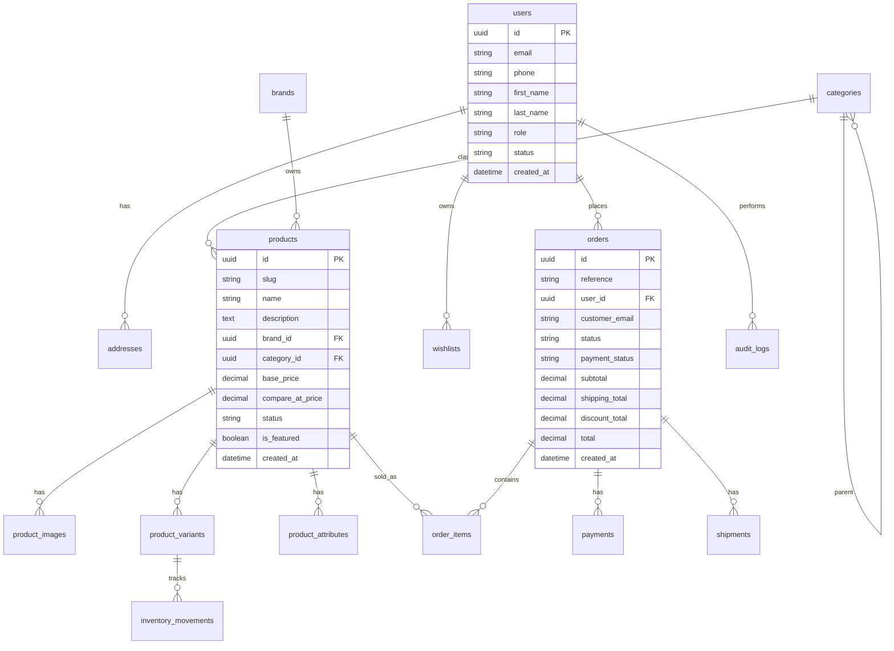

# Soltani Signature — Audit frontend et architecture backend

Date : 2026-07-06  
Repository frontend : `soltani-signature-shop`  
Stack frontend actuelle : React 19, TanStack Start/Router, Vite, Tailwind CSS 4, shadcn/Radix UI, Lovable.

## 1. Résumé exécutif

Le frontend est une excellente maquette e-commerce Lovable : pages boutique, panier, checkout, compte client et back-office admin existent déjà visuellement. En revanche, l’application fonctionne aujourd’hui en mode démo :

- catalogue produit généré côté frontend depuis `src/data/catalog.ts` ;
- filtres métier codés en dur dans `src/data/filters.ts` ;
- panier et wishlist stockés dans `localStorage` ;
- login client/admin simulé par `localStorage` / `sessionStorage` ;
- commandes, clients, produits admin et KPI simulés dans `src/lib/admin/mock-data.ts` ;
- checkout sans vraie validation, sans paiement réel, sans création de commande serveur.

La priorité backend doit être de remplacer progressivement ces sources fictives par une API sécurisée, tout en gardant Lovable comme frontend React.

## 1.1 Décisions MVP confirmées

- Paiement MVP : paiement uniquement à la livraison, sans paiement en ligne.
- Zone de vente/livraison : Tunisie uniquement.
- Livraison : tarif unique pour tous les gouvernorats.
- Administration : un seul compte `super_admin` au lancement.
- Supabase : projet à créer.
- Repository backend : `soltani-signature-api`.

## 2. Audit frontend

### 2.1 Structure fonctionnelle

Pages publiques :

- Accueil : hero, catégories, marques, best sellers, nouveautés, promotions.
- Catalogue : catégories parent/enfant, marques, recherche, filtres, tri.
- Produit : fiche produit, ajout panier, produits liés.
- Panier : liste, quantités, suppression, total.
- Checkout : coordonnées, livraison, paiement, confirmation.
- Compte client : profil, commandes, wishlist, adresses.
- Pages éditoriales : contact, about, legal, univers homme/femme/enfant/maison/bien-être.

Back-office admin :

- Dashboard KPI.
- Produits : liste, création, édition.
- Commandes : liste, détail.
- Clients.
- Contenu marketing : hero, banners, brands, categories, testimonials, marquee.
- Settings.

### 2.2 Données fictives à remplacer

| Zone | Fichier actuel | Remplacement backend |
| --- | --- | --- |
| Catalogue produits | `src/data/catalog.ts` | `GET /products`, `GET /products/:slug` |
| Catégories | `src/data/catalog.ts` | `GET /categories` |
| Marques | `src/data/catalog.ts` | `GET /brands` |
| Filtres/facettes | `src/data/filters.ts` | facettes DB + query dynamique |
| Panier | `src/hooks/useCart.ts` | panier local invité + sync serveur connecté |
| Wishlist | `src/hooks/useWishlist.ts` | `GET/POST/DELETE /me/wishlist` |
| Login client | `src/routes/login.tsx` | Supabase Auth ou API auth NestJS |
| Login admin | `src/routes/admin_.login.tsx` | RBAC serveur obligatoire |
| Admin produits | `src/lib/admin/mock-data.ts` | CRUD admin sécurisé |
| Admin commandes | `src/lib/admin/mock-data.ts` | commandes réelles |
| KPI | `src/lib/admin/kpi.ts` | agrégations backend |
| Checkout | `src/routes/checkout.tsx` | création commande transactionnelle |

### 2.3 Risques actuels

- Auth non sécurisée : un utilisateur peut ouvrir l’admin en posant `soltani-admin-auth=1` dans le navigateur.
- Données non persistantes : panier, wishlist et dernière commande dépendent du navigateur.
- Pas de validation serveur : prix, quantités, frais et paiement peuvent être manipulés côté client.
- Pas de gestion de stock réelle : risque de survente.
- Pas d’audit admin : aucune traçabilité des changements.
- Pas de séparation staging/prod visible.

## 3. Stack backend recommandée

### 3.1 Choix principal

- Backend : NestJS.
- ORM : Prisma.
- Base : Supabase Postgres.
- Auth : Supabase Auth pour clients + RBAC applicatif côté backend.
- Storage : Supabase Storage pour images produits/bannières, ou Cloudflare R2 plus tard.
- Cache/rate-limit : Upstash Redis ou Redis provider gratuit en staging.
- Frontend : Lovable/TanStack Start consommant l’API backend.
- DNS/WAF/SSL : Cloudflare.
- CI/CD : GitHub Actions.

Pour le MVP confirmé, le module paiement restera volontairement minimal : création commande + statut `cash_on_delivery`, sans intégration carte bancaire, D17 ou provider externe.

### 3.2 Pourquoi NestJS ici

NestJS est un bon choix pour cette plateforme parce que :

- architecture modulaire claire pour e-commerce ;
- sécurité centralisée via guards, interceptors, pipes, DTO validation ;
- meilleure maintenabilité qu’un backend improvisé en edge functions ;
- scalable horizontalement si on passe plus tard vers VPS, Render, Fly.io, Railway, ou Kubernetes ;
- compatible Prisma/Postgres, queues, webhooks paiement, jobs, admin RBAC.

Supabase reste excellent pour Postgres, Auth, Storage et dashboard DB. La logique métier critique doit rester dans NestJS, pas dispersée dans le frontend.

## 4. Architecture cible

### 4.1 Modules NestJS proposés

- `auth` : validation JWT Supabase, rôles, sessions admin.
- `users` : profil client, préférences, adresses.
- `catalog` : catégories, marques, produits, variantes, facettes.
- `inventory` : stock, mouvements, alertes.
- `cart` : panier serveur pour utilisateurs connectés.
- `wishlist` : favoris client.
- `orders` : checkout, commandes, statuts, historique.
- `payments` : paiement à la livraison d’abord, providers ensuite.
- `shipping` : méthodes, frais, gouvernorats, suivi.
- `content` : hero, banners, marques mises en avant, testimonials, legal.
- `admin` : endpoints back-office et KPI.
- `uploads` : images et fichiers.
- `notifications` : emails transactionnels.
- `audit` : journal d’actions admin.

## 5. Schéma base de données initial

### 5.1 Tables prioritaires MVP

1. `users` : miroir applicatif des utilisateurs Supabase Auth.
2. `addresses` : adresses de livraison/facturation.
3. `categories` : hiérarchie parent/enfant.
4. `brands` : marques.
5. `products` : fiche produit.
6. `product_images` : galerie images.
7. `product_variants` : SKU, prix, stock logique.
8. `product_attributes` : filtres dynamiques par produit.
9. `wishlists` : favoris.
10. `orders` : commande.
11. `order_items` : lignes de commande avec snapshot prix/nom.
12. `payments` : statut et provider.
13. `shipments` : livraison.
14. `content_blocks` : contenus marketing éditables.
15. `audit_logs` : actions sensibles admin.

## 6. API MVP à construire

### Public

- `GET /health`
- `GET /catalog/categories`
- `GET /catalog/brands`
- `GET /catalog/products`
- `GET /catalog/products/:slug`
- `GET /catalog/search?q=`
- `POST /newsletter/subscribe`
- `POST /contact`

### Client connecté

- `GET /me`
- `PATCH /me`
- `GET /me/addresses`
- `POST /me/addresses`
- `GET /me/wishlist`
- `POST /me/wishlist/:productId`
- `DELETE /me/wishlist/:productId`
- `GET /me/orders`
- `GET /me/orders/:id`

### Checkout

- `POST /checkout/quote`
- `POST /orders`
- `POST /payments/initiate`
- `POST /payments/webhook/:provider`

### Admin

- `GET /admin/kpi`
- `GET/POST/PATCH/DELETE /admin/products`
- `GET/POST/PATCH/DELETE /admin/categories`
- `GET/POST/PATCH/DELETE /admin/brands`
- `GET/PATCH /admin/orders`
- `GET /admin/customers`
- `GET/POST/PATCH/DELETE /admin/content-blocks`
- `GET /admin/audit-logs`

## 7. Sécurité DevSecOps cible

- Auth JWT Supabase vérifiée côté NestJS.
- RBAC : `customer`, `admin`, `super_admin`.
- Validation stricte DTO avec `class-validator` + `ValidationPipe`.
- Prisma sans requêtes SQL dynamiques non contrôlées.
- Rate limiting sur auth, checkout, contact, newsletter.
- Helmet, CORS strict, CSP côté Cloudflare/frontend.
- Secrets uniquement en variables d’environnement.
- Webhooks paiement signés.
- Logs structurés sans données sensibles.
- Audit logs sur actions admin critiques.
- Backups Supabase + exports réguliers.
- Environnements séparés : local, staging, prod.

## 8. Plan de migration frontend

1. Créer client API typé dans le frontend.
2. Remplacer `src/data/catalog.ts` par endpoints catalogue.
3. Garder panier local invité, puis synchroniser côté serveur après login.
4. Remplacer login/register par Supabase Auth.
5. Protéger admin par vrai rôle backend.
6. Brancher admin produits/catégories/marques.
7. Brancher checkout et commandes.
8. Brancher contenu marketing éditable.
9. Ajouter QA E2E sur parcours achat.

## 9. Repositories

Recommandation : créer un repository backend séparé nommé `soltani-signature-api`.

Raison :

- cycle de déploiement backend indépendant de Lovable ;
- secrets et migrations isolés ;
- meilleure lisibilité DevOps ;
- CI/CD séparée frontend/backend ;
- possibilité de transformer plus tard en monorepo si nécessaire.

Je peux créer/scaffolder la structure NestJS + Prisma localement, puis vous pourrez soit créer le repo GitHub, soit me donner accès pour le créer via GitHub. Pour garder le contrôle organisationnel, l’option la plus propre est que vous créiez le repo vide sur GitHub, puis je pousse la structure initiale.

## 10. Informations nécessaires avant implémentation

### Business

- Pays de vente au MVP : Tunisie uniquement.
- Devise officielle : TND uniquement.
- Modes de paiement MVP : paiement à la livraison uniquement.
- Livraison : tarif unique sur tous les gouvernorats.
- Politique stock : bloquer commande si stock insuffisant ?

### Catalogue

- Liste réelle catégories/sous-catégories à valider.
- Liste réelle marques.
- Champs produit obligatoires : SKU, référence fournisseur, authenticité, garantie, poids, dimensions.
- Gestion variantes : taille, couleur, contenance, pointure, matière.

### Sécurité/admin

- Liste des comptes admin initiaux : un seul compte super admin.
- Rôles nécessaires MVP : `super_admin` uniquement.
- Actions admin à auditer.

### Intégrations

- Projet Supabase : à créer.
- Hébergement backend souhaité pour staging/prod.
- Provider email transactionnel : SMTP OVH au départ ou Resend/Brevo plus tard.
- Provider paiement : aucun provider en ligne au MVP.

## 11. Prochaine étape recommandée

Créer le repository backend `soltani-signature-api`, puis générer :

- projet NestJS ;
- Prisma connecté à Supabase Postgres ;
- modules de base ;
- schéma Prisma MVP ;
- migrations initiales ;
- seed de catégories/produits depuis les données frontend ;
- Swagger/OpenAPI ;
- pipeline CI lint/test/build.
